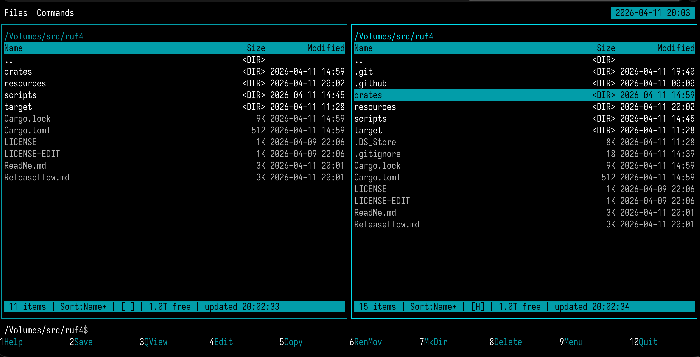
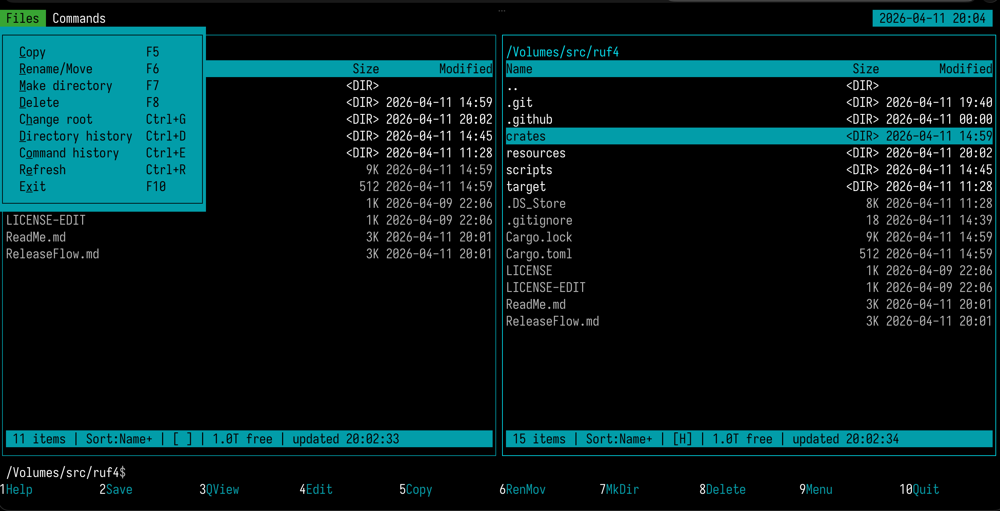
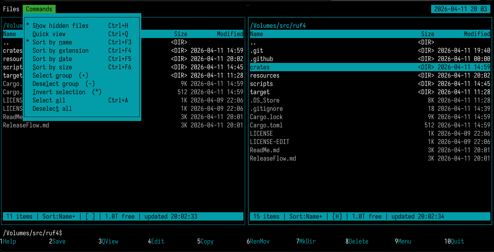
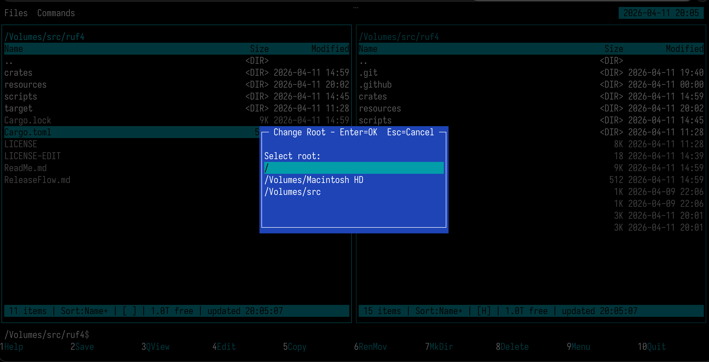
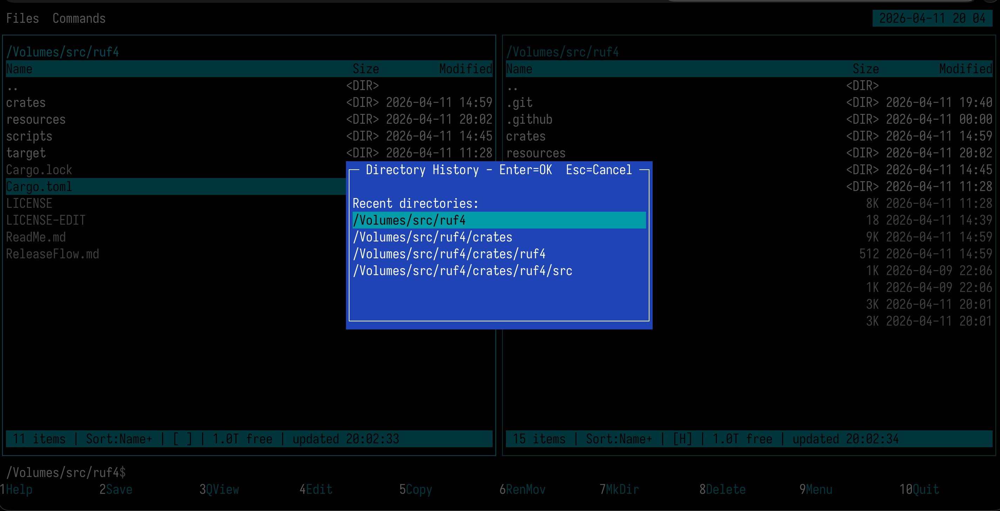
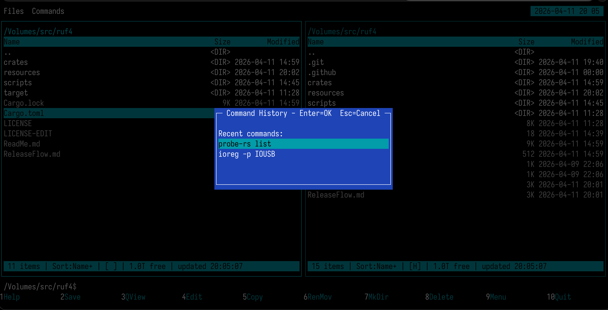

# ruf4

  

> NOTE: This is **alpha-quality** software! It _may_ delete and/or corrupt
> your files at some point and cause other losses, non-intentionally though.
> Also your sense of aesthetics _may_ be hurt. Use at _your own_ risk and expense.
> I'm always happy to make it better if you tell me what should be changed, or
> you can post a PR in the spirit of OSS.

We all sometimes file, and here is a double-panel file commander. It's been created
because I couldn't use what I wanted to due to legal regulations, and what I could
use looked bad, didn't have the true rough spirit of a double-panel file commander.
So rock ur files, folks :)

This is built in Rust on the TUI framework derived from
[Microsoft Edit](https://github.com/microsoft/edit). It is an immediate mode TUI,
very small and just enough.

Runs on Linux, macOS, and Windows. You can download the latest pre-release [0.0.1](https://github.com/kromych/ruf4/releases/tag/v0.0.1).

If you are a developer, [here](./ReleaseFlow.md) are the gory details and notes on builds/releases.
## Screenshots

## Keyboard shortcuts

### Navigation

| Key | Action |
|-----|--------|
| Up / Down | Move cursor |
| Page Up / Page Down | Scroll by page |
| Home / End | Jump to first / last entry |
| Enter | Enter directory or open file |
| Tab | Switch active panel |
| Backspace | Go to parent directory (in command line) |
| Alt+letters | Quick search: jump to file by name prefix |

### File operations

| Key | Action |
|-----|--------|
| F5 | Copy |
| F6 | Rename / Move |
| F7 | Make directory |
| F8 | Delete |
| Delete | Delete |
| Ctrl+G | Change root / drive |
| Ctrl+D | Directory history |
| Ctrl+E | Command history |
| Ctrl+R | Refresh both panels |

### Selection

| Key | Action |
|-----|--------|
| Insert / Shift+Space | Toggle selection on current entry |
| + | Select group (glob pattern) |
| - | Deselect group (glob pattern) |
| * | Invert selection |
| Ctrl+A | Select all |

### View & sorting

| Key | Action |
|-----|--------|
| Ctrl+Q | Toggle quick view panel |
| Ctrl+H | Toggle hidden files |
| Ctrl+F3 | Sort by name |
| Ctrl+F4 | Sort by extension |
| Ctrl+F5 | Sort by date |
| Ctrl+F6 | Sort by size |

### General

| Key | Action |
|-----|--------|
| F1 | Help screen |
| F2 | Save settings |
| F3 / Ctrl+Q | Toggle quick view panel |
| F9 | Focus menubar |
| F10 | Quit (with confirmation) |
| Any letter | Activate command line |

### Command line

Type any text to activate the command line at the bottom of the screen.
Commands run in the active panel's directory.

| Key | Action |
|-----|--------|
| Enter | Execute command |
| Escape | Cancel |
| Backspace | Delete character |

### Dialogs

Most confirmation dialogs respond to:

| Key | Action |
|-----|--------|
| Y / Enter | Confirm |
| N / Escape | Cancel |
| A | All (in overwrite prompts) |

### Mouse

- Click a panel to make it active
- Click a file entry to select it
- Double-click to enter a directory or open a file
- Scroll wheel to navigate
- Click the function key bar at the bottom for quick access

### Clicking around

| Area | Action |
|------|--------|
| Panel path (title bar) | Open change root dialog |
| File entry | Select entry; double-click to open/enter |
| Sort indicator in footer (`Sort:Name+`) | Open sort mode dialog |
| Hidden indicator in footer (`[H]` / `[ ]`) | Toggle hidden files |
| Function key bar (bottom row) | Invoke the corresponding F-key action |
| Help dialog entry | Close help and invoke the shortcut's action |

## License

MIT
